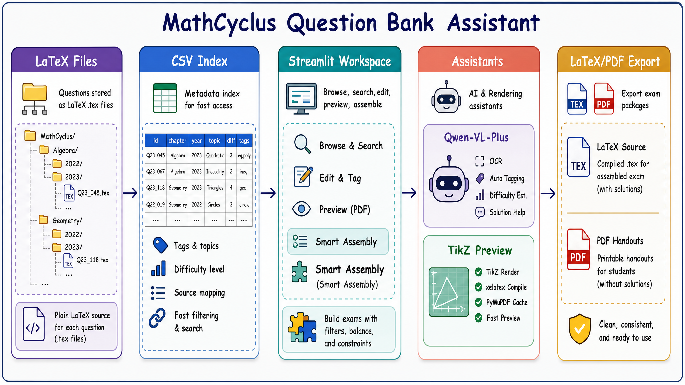

# 📚 高中数学题库管理与组卷系统

这是一个基于 Python (Streamlit) 和 LaTeX 的自动化高中数学题库管理与智能组卷系统。专为中学数学教师及教研团队设计，旨在彻底解决海量 LaTeX 题目的碎片化管理、高效排版以及智能化组卷问题。

## 🧭 系统工作流



从按章节/年份组织的 LaTeX 题目源文件出发，系统构建 CSV 元数据索引，在 Streamlit 工作台中完成检索、编辑、预览与智能组卷，并通过 Qwen-VL-Plus 和 TikZ 渲染管线增强 OCR、打标签、解答生成和几何图预览能力，最终导出 LaTeX 试卷源文件与 PDF 讲义。

## ✨ 核心功能

### 📝 题库管理

面向 LaTeX 题目源文件的结构化管理流程。

- 按「板块 / 年份」自动归档题目文件。
- 使用 `problem`、`answer`、`solutions` 环境分离题干、答案与解析。
- 通过题目元数据记录 ID、标签、难度、来源与备注。

### 🤖 AI 辅助录入

基于 Qwen-VL-Plus 处理截图、标签和解答生成。

- 识别题目截图并转换为规范 LaTeX。
- 自动生成知识点标签与难度星级。
- 对解答进行“教学审核”，发现逻辑问题时附加 AI 纠错说明。

### 🧠 智能组卷

从题库中按条件筛选、抽样并生成试卷。

- 支持题型、年份、板块、标签、难度与全文检索。
- 支持按知识板块、题量与目标难度分布进行抽样。
- 支持自然语言组卷需求润色，辅助形成命题意图。

### 🎨 工作台界面

采用 Streamlit 构建教师可直接使用的本地工作台。

- 三栏式布局：左侧筛选，中间编辑，右侧预览与 AI 助手。
- 徽章式展示星级、标签、备注等题目状态。
- 支持快速浏览、编辑、预览和组卷流程切换。

### 📐 TikZ 预览

将几何图代码直接嵌入题目编辑与预览链路。

- 通过 `xelatex` 编译 TikZ 图形。
- 使用 `PyMuPDF` 将编译结果转为 PNG 预览。
- 基于文件修改时间缓存，减少重复渲染开销。

## 🛠️ 技术栈

- **前端界面与交互**：[Streamlit](https://streamlit.io/) (响应式框架，多列布局，回调机制)
- **排版与编译引擎**：**$\LaTeX$** (核心依赖 `xelatex` 编译器)
- **底层脚本与处理**：Python (`re` 文本处理, `fitz` PDF图像解析, 抽样算法)
- **大语言模型支持**：阿里云百炼 (Qwen-VL-Plus 模型)
- **版本控制**：Git/GitHub (配置代理优化大文件传输同步)

## 🚀 快速启动

1. 确保本机已安装 **Python 3.8+**。建议先创建虚拟环境：

   ```bash
   python -m venv .venv
   .venv\Scripts\activate
   ```
2. 安装 Python 依赖：

   ```bash
   pip install -r requirements.txt
   ```
3. 复制 `.env.example` 为 `.env`，并填入 AI 模型配置：

   ```env
   AI_API_KEY=your_api_key_here
   AI_BASE_URL=https://dashscope.aliyuncs.com/compatible-mode/v1
   AI_MODEL_NAME=qwen-vl-plus
   ```
4. 如需使用 TikZ 几何图预览，请安装完整的 **$\LaTeX$ 编译环境**（例如 TeX Live），并确认 `xelatex` 已加入系统环境变量。项目会通过 `PyMuPDF` 将编译结果转为 PNG 预览。
5. 首次使用或批量导入题目后，建议重建题库索引：

   ```bash
   python utils/init_csv_index.py
   ```
6. 双击运行 `启动程序.bat`，或者在终端执行：

   ```bash
   python 启动程序.py
   ```

   即可自动在浏览器中打开工作台。

也可以直接运行 Streamlit：

```bash
streamlit run question_bank_app.py
```

## 💡 创新亮点

- **首创"教学审核"OCR**：AI 识别解答时自动审核逻辑，发现错误会标注原错并附加 AI 纠错，兼顾教学真实性与正确性。
- **严苛的 LaTeX 排版规范**：通过 AI Prompt 强制约束分数显示、括号匹配、中英文混排空格等细节，输出代码可直接用于专业出版。
- **Label Data 元数据系统**：每道题自带 ID、难度星级、标签、备注、引用次数的结构化注释头，实现题目级别的精细化管理。
- **TikZ 深度整合 + 智能缓存**：几何图形编译无缝嵌入编辑流程，基于文件修改时间的缓存机制实现秒级实时预览。

## 📁 核心目录结构

```text
├── chapters/              # 存放按学科板块和年份分类的 LaTeX 题库源文件 (.tex)
├── fig/                   # README 与文档配图
├── utils/                 # 系统核心工具库 (配置、文件读写、TikZ 渲染、CSV 索引管理)
├── Test Paper Group/      # LaTeX 试卷/讲义/练习模板
├── ocr_prompt.txt         # AI OCR 与排版约束的系统提示词（热重载）
├── MathCyclus_book.cls    # LaTeX 自定义文档类
├── question_bank_app.py   # Streamlit 主程序入口 (包含 UI 布局与核心逻辑)
├── 启动程序.py             # 守护进程与服务启动脚本
├── 启动程序.bat            # Windows 一键启动脚本
├── requirements.txt       # Python 依赖清单
└── .env.example           # 环境变量配置模板
```

## 🧹 仓库维护说明

- `utils/题库索引表.csv` 是可重建的高速索引，题库内容变化后可运行 `python utils/init_csv_index.py` 刷新。
- `log.csv` 是批量导入脚本的运行日志输出；`old_app.py`、`question_bank_app000.py` 和 `SolaireEPDA-master/` 属于历史产物或外部参考内容。当前 `.gitignore` 已将同类文件排除，后续如需清理 Git 跟踪记录，建议单独开 PR 处理。
- TikZ 预览依赖本机 `xelatex`，若未安装 LaTeX，题库浏览与普通组卷仍可使用，但几何图实时预览会受限。

## 📄 开源协议

本项目采用 MIT License 开源协议，欢迎贡献与使用。

## 👥 用户群

如果你正在使用或关注 MathCyclus，欢迎扫码加入用户群，交流本地部署、题目录入、LaTeX 排版、组卷流程与后续功能建议。


